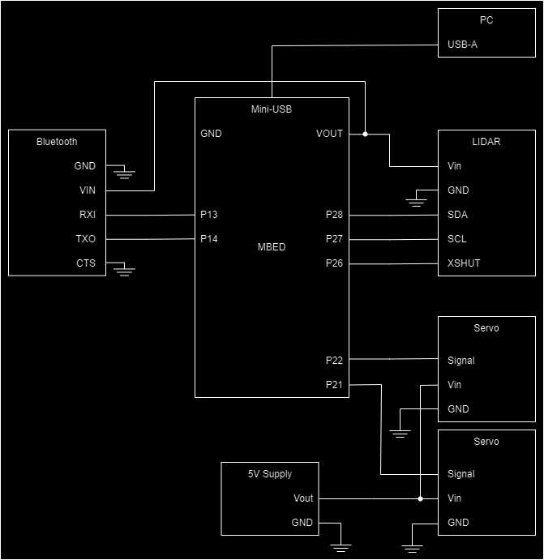
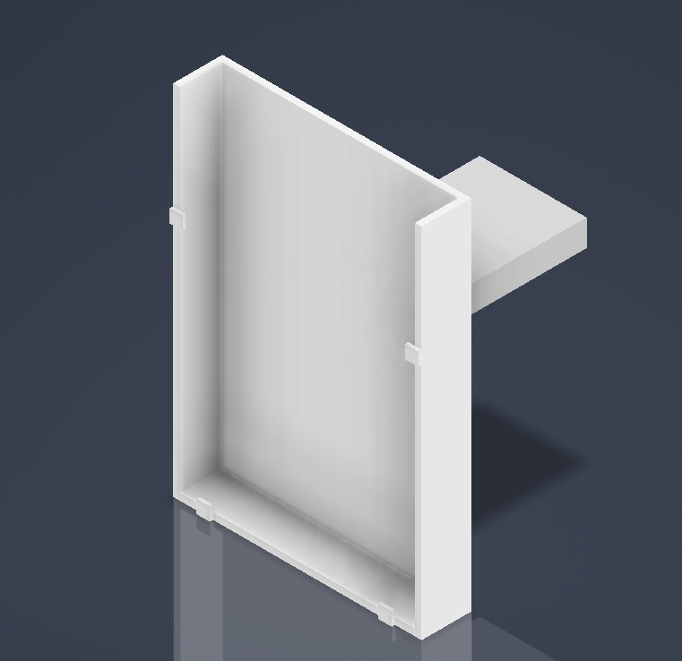
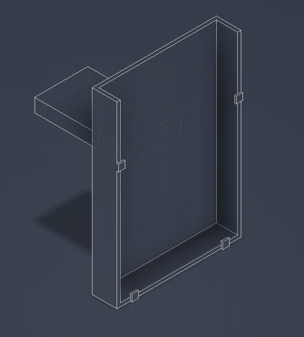
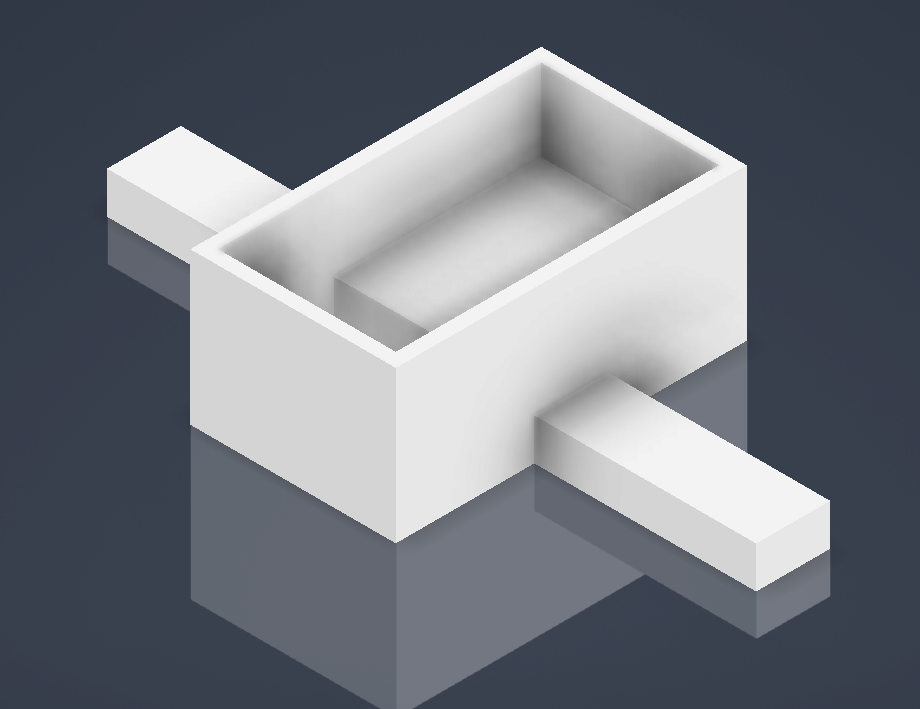
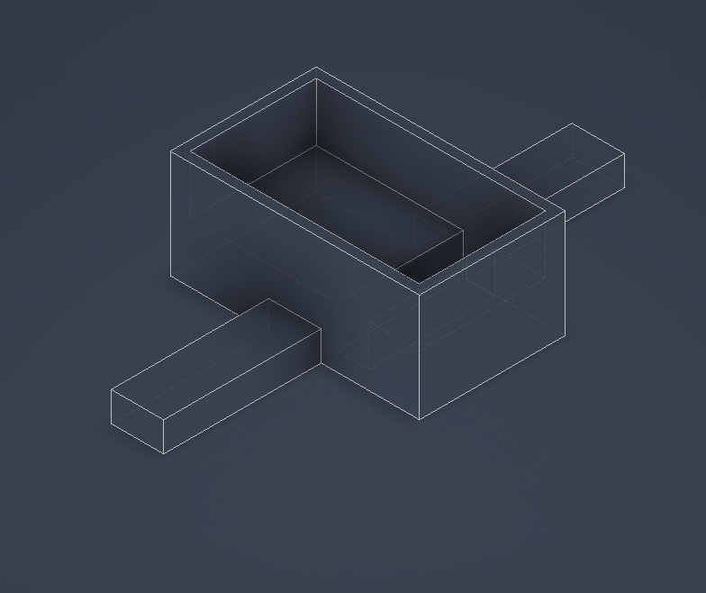
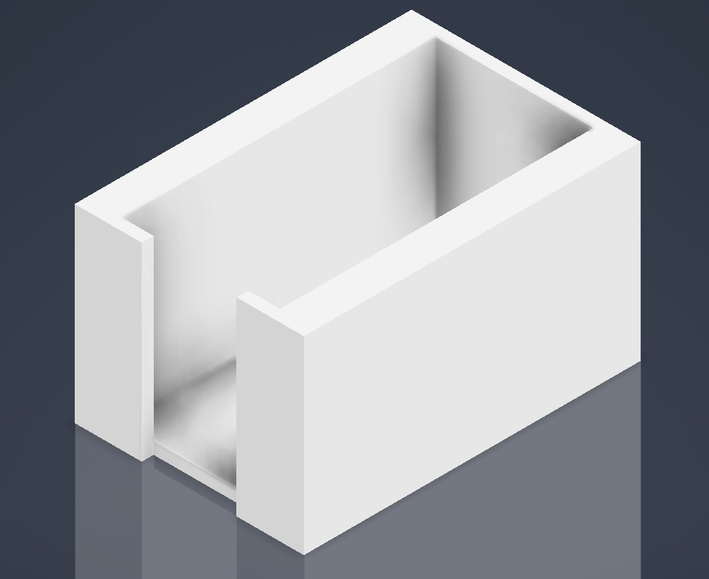
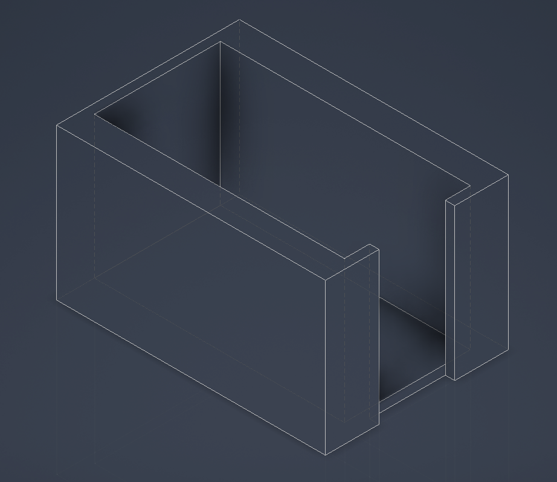

# LIDAR-3D-Mapping
A bluetooth controlled, 2 servo axis actuated LIDAR sensor that maps coordinates to a 3D rendering desktop application 
Final Project - Georgia Tech - ECE 4180 - Spring 2024

## Author
- Connor Sempf - [connortsempf](https://github.com/connortsempf)

## Description

## Features

## Devices and Components
**Hardware Components:**
- mBed LPC1768 Microcontroller - [Reference Site](https://os.mbed.com/platforms/mbed-LPC1768/)
- Adafruit Bluefruit LE Uart Bluetooth Board - [Reference Site](https://os.mbed.com/users/4180_1/notebook/adafruit-bluefruit-le-uart-friend---bluetooth-low-/)
- Adafruit VL53L0X LIDAR ToF Distance Sensor Board - [Reference Site](https://os.mbed.com/users/4180_1/code/HelloWorld_VL53L0X_LPC1768/)
- HiTEC HS-422 Deluxe Servo Motor (2) - [Reference Site](https://os.mbed.com/users/4180_1/notebook/an-introduction-to-servos/) 

**Miscellaneous Components:**
- 3D Printed Parts
- 30 Row Solderless Breadboard
- 63 Row Solderless Breadboard
- Mini-USB to USB-A Cable
- Smartphone with 'Bluefruit Connect' App
- PC or Laptop
- 5V Supply
- Jumper Wires 

**Hardware Wiring Diagram:**  

**3D Printed Part Models:**  

## Demo Videos and Images

## Source Code
