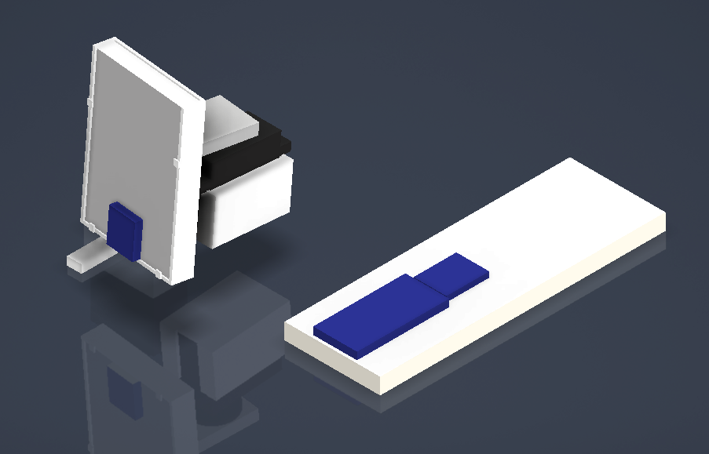
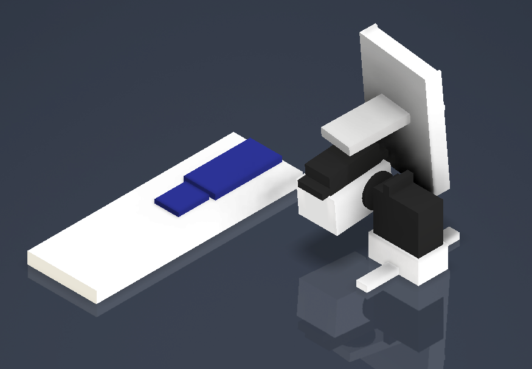

# LIDAR-3D-Mapping
Final Project - Georgia Tech - ECE 4180 - Spring 2024 
Create 3D point models with the mBed microcontroller, basic hardware peripherals, and a 3D rendering desktop application

## Author
- Connor Sempf - [connortsempf](https://github.com/connortsempf)

## Description
This project combines a bluetooth breakout board and two-servo, two-axis controlled LIDAR ToF scanner. It transmits polar coordinate data via USB virtual COM Port to a PC for mapping to 3D space coordinates in a pygame 3D rendering desktop application. This allows the user to visualize their scanned object and use the data for any 3D modelling application. Data is mapped and rendered in real-time so watching the LIDAR acquisition is possible. Manual servo control is enabled to calibrate a relative zero position for LIDAR alignment, and set new vertical and horizontal scanning range boundaries. 

## Features
- **LIDAR Distance Scanning**: The main component of this device setup is to retrieve distance scanning data from the LIDAR ToF sensor. The breakout board will return a millimeter distance value when called upon.
- **Bluetooth Control**: With the bluetooth chip, the user can communicate with the servos and LIDAR sensor to initialize a scanning period for rendering, set relative zero positions for the servos to create a repeatable starting point, and maneuver the actuators manually for determining a scanning range.
- **2-Axis Servo Maneuvering**: The user can instruct the servos to independently move vertically and horizontally by a variable degree interval. This gives an editable 2D area of scanning.
- **3D Rendering and Visualization**: The desktop python pygame application plots coordinate points in 3D space received from the mBED and LIDAR sensor to provide the user with a view of any scanned object. The software has full capability of rotating, scaling, and translating views to see the model from any angle.
- **3D Printed Supports**: Contained in this repository are 3D models and STL files for printing. These components are used to hold together the pivoting mechanism for the LIDAR sensor and servo motors.

## Devices and Components
**Hardware Components:**
- mBed LPC1768 Microcontroller - [Reference Site](https://os.mbed.com/platforms/mbed-LPC1768/)
- Adafruit Bluefruit LE Uart Bluetooth Board - [Reference Site](https://os.mbed.com/users/4180_1/notebook/adafruit-bluefruit-le-uart-friend---bluetooth-low-/)
- Adafruit VL53L0X LIDAR ToF Distance Sensor Board - [Reference Site](https://os.mbed.com/users/4180_1/code/HelloWorld_VL53L0X_LPC1768/)
- HiTEC HS-422 Deluxe Servo Motor (2) - [Reference Site](https://os.mbed.com/users/4180_1/notebook/an-introduction-to-servos/)  

**Miscellaneous Components:**
- 3D Printed Parts
- 30 Row Solderless Breadboard
- 63 Row Solderless Breadboard
- Mini-USB to USB-A Cable
- Smartphone with "Bluefruit Connect" App
- PC or Laptop
- 5V Supply
- Jumper Wires  

**Hardware Wiring Diagram:**  
  

**3D Printed Part Models:**  

 

 

 

  

## Images and Demos
 
 
 
 
 

## Source Code
